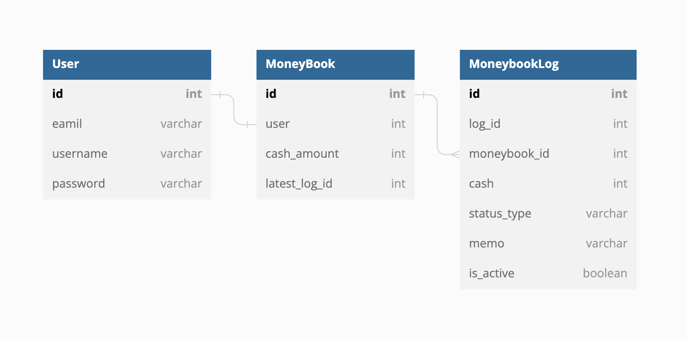

# 소개

가계부 관리를 위한 API 개발 프로젝트 입니다.

# 설계

## 요구사항
1. user는 email, password 입력을 통해 회원가입.
2. user는 회원가입 이후, 로그인, 로그아웃 가능.
3. 고객은 로그인 이후 가계부 관련 아래 행동 가능.
    a. 가계부에서 오늘 사용한 돈의 금액, 관련 메모 남길수 있다.
    b. 가계부에서 수정을 원하는 내역은 금액, 메모를 수정가능.
    c. 가계부에서 삭제를 원하는 내역은 삭제 가능.
    d. 삭제한 내역은 언제든지 다시 복구 할 수 있어야 한다.
    e. 가계부에서 기록한 모든 내역 리스트를 볼 수 있다.
    f. 가계부에서 상세 한 세부 내역을 볼 수 있다.
4. 로그인 하지 않은 user는 가계부 내역에 대한 접근 제한 처리가 되어야 한다.

## ERD

## API Endpoint

|INDEX|URI|METHOD|DESC|
|:---:|:---|:---:|:---:|
|1|/user/signup/|POST|회원가입|
|2|/user/signin/|POST|로그인|
|3|/user/logout/|GET|로그아웃|
|4|/moneybook/|GET|가계부 리스트 조회|
|5|/moneybook/|POST|가계부 작성|
|6|/moneybook/\<int:log_id\>/|GET|가계부 내역 상세조회|
|7|/moneybook/\<int:log_id\>/|PUT|가계부 내역 수정/삭제|
|8|/moneybook/restore/|GET|삭제 내역 조회|
|9|/moneybook/restore/\<int:log_id\>/|PATCH|삭제 내역 복구|
# 사용된 기술
  - Framework : Django, DRF
  - Database : mysql

